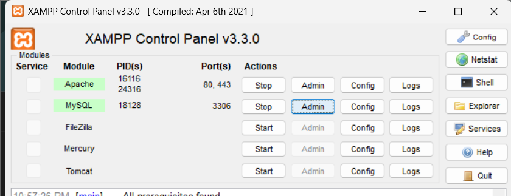
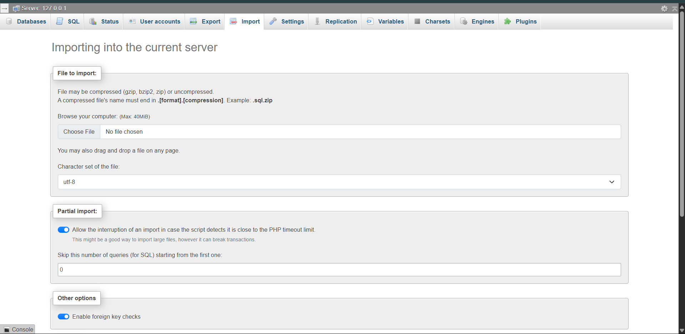

# 🥗 SEA Catering — Aplikasi Langganan Paket Makanan Sehat
---

**SEA Catering** adalah **platform web** untuk langganan paket makanan sehat yang bisa **disesuaikan** sesuai kebutuhan pelanggan di seluruh Indonesia.  
Pelanggan dapat:
- Memilih paket sesuai tujuan (*diet*, *protein*, *premium*)
- Mengatur jadwal pengiriman
- Menjeda atau menghentikan langganan dengan mudah melalui **Dashboard Interaktif**

> **✨ Tidak hanya untuk pelanggan, admin juga memiliki Dashboard Admin yang lengkap untuk memantau:**
> - Statistik pertumbuhan bisnis
> - Grafik langganan
> - Manajemen pengguna
> - Testimonial pelanggan  
> Semua data **real-time** dan mudah digunakan

---

## ✨ Fitur Utama

**🔐 Autentikasi Pengguna**  
Sistem registrasi dan login yang aman untuk menjaga data pelanggan tetap terlindungi.

---

**🍽️ Menu Paket Interaktif**  
Jelajahi berbagai paket makan dengan detail, gambar menarik, dan informasi gizi.

---

**⚙️ Form Langganan Dinamis**  
Hitung total harga secara otomatis sesuai pilihan paket dan durasi langganan.

---

**📊 Dashboard Pengguna**  
Kelola status langganan: jeda, lanjut, atau batalkan kapan saja melalui dashboard interaktif.

---

**🗂️ Dashboard Admin**  
Lihat statistik pertumbuhan bisnis, grafik langganan, filter data berdasarkan rentang tanggal, dan kelola data pengguna secara real-time.

---

**💬 Sistem Testimoni**  
Pelanggan dapat memberi ulasan dan penilaian untuk meningkatkan kepercayaan pengguna baru.

---

**📱 Desain Responsif**  
Tampilan modern dan nyaman di desktop maupun mobile — mudah digunakan di mana saja.

---


## ⚡️ Setup & Instalasi

### 📋 Persyaratan

Sebelum memulai, pastikan kamu sudah menginstal:

- **PHP 8.x**
- **Composer**
- **Node.js & NPM**
- **MySQL / MariaDB** (Laragon atau XAMPP)

### 1️⃣ Clone Repository

Pertama, clone repository project ini ke terminal di IDE-mu:

```bash
git clone https://github.com/asyrafrzki/sea-catering.git
```

Lalu pindah ke direktori project:

```bash
cd sea-catering

```
### 2️⃣ Install Dependencies

Selanjutnya, install semua dependensi yang dibutuhkan, baik untuk PHP maupun JavaScript:

```bash
# Install composer
composer install

# Install JavaScript npm
npm install
```
### 3️⃣ Konfigurasi Environment

```
Set up file `.env` 
```

 buka file .env dan atur koneksi database sesuaikan dengan server lokalmu. konfigurasi untuk XAMPP:

```bash
DB_CONNECTION=mysql
DB_HOST=127.0.0.1
DB_PORT=3306
DB_DATABASE=sea_catering
DB_USERNAME=root
DB_PASSWORD=
```
setelah itu  generate APP_KEY:

``` bash
php artisan key:generate

```

### 4️⃣ Database Set Up
import database **sea_catering** kedalam XAMPP

### download file .sql

```bash
file .sql berada di folder /database

```
### lalu buka XAMPP lalu click admin di MySQL:


### lalu masukkan file .sql tadi:


### lalu click import
### NOTE:
### jika kamu import maka tidak perlu:
```bash
php artisan db:create
php artisan migrate:fresh --seed
```
## karena akan menghapus isi yang sudah ada di database

### 5️⃣ Compile Assets Front-end

```bash
npm run dev

```
### 6️⃣ Jalankan Aplikasi

```
php artisan serve

```
klik:
```
http://localhost:8000.
```

## 🔑 Login Admin
```
Email = admin@gmail.com
Password = Admin123!
```
